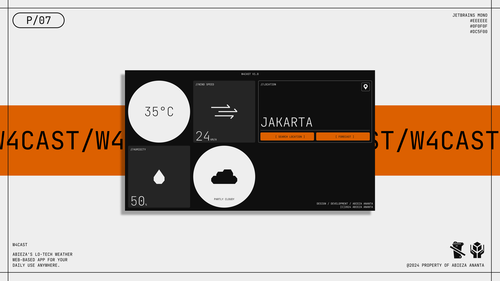

# W4CAST

A simple weather web-based app powered by Vue.js and WeatherAPI.

## General Info

This app contains primary weather information such as temperature, wind speed, humidity, and weather condition based on the location. This project was made for personal learning material and is currently unfinished. More features are planned to be added soon as the development continues.

## Features

- Primary weather information
- Location search
- Responsive design

## Tech Stack

**Design** :

- Inkscape
- Figma

**Development** :

- Vue.js
- WeatherAPI ( free plan; yes I'm broke lol )

## Color Reference

| Color   | Hex                                                              |
| ------- | ---------------------------------------------------------------- |
| Light   |  #eeeeee |
| Dark    |  #0f0f0f |
| Primary |  #dc5f00 |

## Additional Info

Since I mentioned that this project was made for personal "learning material", feel free to use it as a learning resource too. This project consists of frontend practices such as the use of a framework, responsive design implementation, API integration, and more.

## License

This repository is licensed under the Creative Commons Attribution-NonCommercial 4.0 International (CC BY-NC 4.0) License. You are free to use, share, and adapt the material for non-commercial purposes, as long as you give appropriate credit. For more details, please see the [LICENSE](./LICENSE.txt) file.
